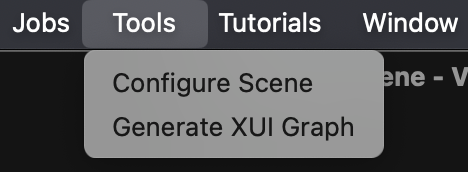
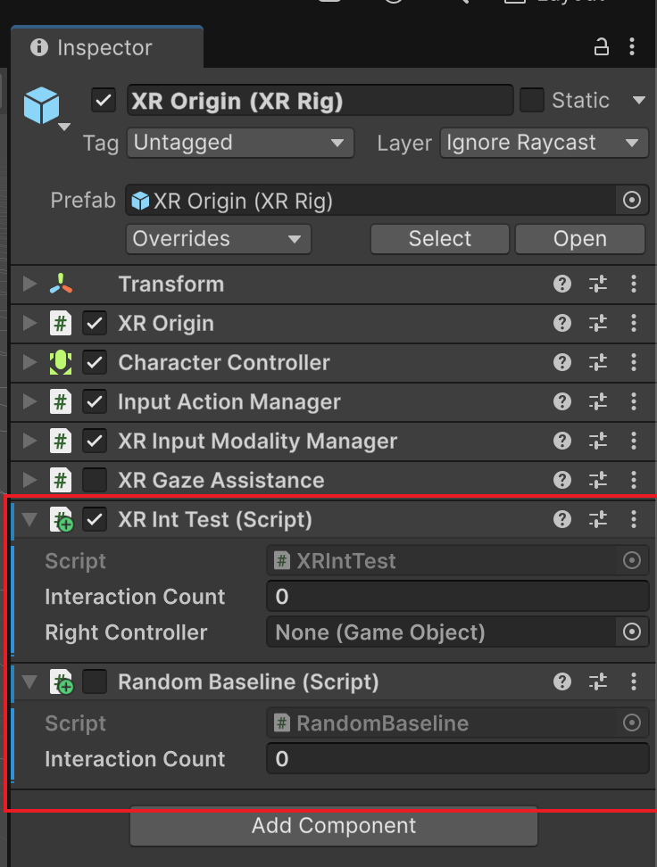

# XRintTest

# Instructions

## Requirement Checking/Installation

### Unity

1. Run `sh check_unity.sh` in the root directory of XRintTest to check if Unity is successfully installed.
2. If not installed, go to https://unity.com/ to download and install.

### Packages/Scripts

1. Run `add_requirements.sh 'unity_project_path'` in the root directory of XRintTest to add required packages and XRintTest scripts to the Unity project

### Scene Configuration

1. Open Unity Editor
2. Launch the scene under test
3. Open the **Tools** tab at the top of the Unity Editor
4. Click **Configure Scene**

### Construct XR User Interaction Graph

1. Open the **Tools** tab at the top of the Unity Editor
2. Click **Generate XUI Graph**

### Run XRintTest

1. Double click the **XR Origin (XR Rig)** object in the root of the Unity scene
2. In the Inspector, tick the **XR Int Test (Script)** component to activate the tool and make sure **Random Baseline (Script)** is not ticked; to run the Random Baseline, untick the **XR Int Test (Script)** and tick **Random Baseline (Script)**
3. Click the Play button to start running the scene and testing

# Resource for Future Work

## Deep Learning (Unity ML Agents)

* [Reinforcement Deep Q Learning for playing a game in Unity](https://medium.com/ml2vec/reinforcement-deep-q-learning-for-playing-a-game-in-unity-d2577fb50a81)
* [An Introduction to Unity ML-Agents](https://huggingface.co/learn/deep-rl-course/unit5/introduction)
* [ML-Agents: Hummingbirds](https://learn.unity.com/course/ml-agents-hummingbirds)

